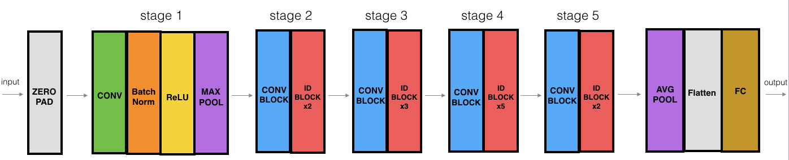

# ResNet: Sign language recognition

Recognizing multiple classes of objects from images is a common computer vision task. Here we have a 6-class problem where we want to recognize 6 different digits (0, 1, 2, 3, 4, 5) of [American Sign Language](https://en.wikipedia.org/wiki/American_Sign_Language) given an image of a hand. We build a convolutional neural network for this multi-class classification task, in particular the very deep 50-layer [residual neural network](https://arxiv.org/pdf/1512.03385.pdf) (ResNet-50) using TensorFlow Keras Functional API. I did this project in the [Convolutional Neural Networks](https://www.coursera.org/learn/convolutional-neural-networks) course as part of the [Deep Learning Specialization](https://www.coursera.org/specializations/deep-learning).

## Datasets
We have 1080 training examples and 120 test examples, where each example is of shape (64, 64, 3) with each of RGB channel image is of size 64x64. The examples are labeled as one of 0, 1, 2, 3, 4, and 5 for the corresponding digits. These labels are one-hot encoded to be used as the target output of the recognizer, as shown below.

## Residual neural network architecture
We used TensorFlow Keras Functional API to build the ResNet-50 model depicted below. 

We trained the convolutional neural network for 10 epochs with the Keras model's `.fit()` method and evaluated its performance with the model's `evaluate()` method. The model shows the training accuracy of 0.93 and the test accuracy of 0.94.
